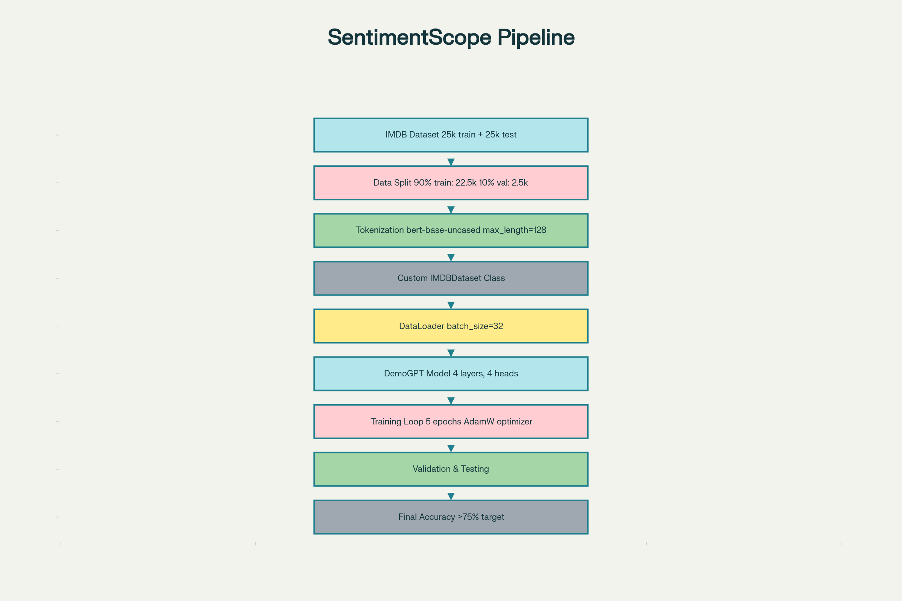
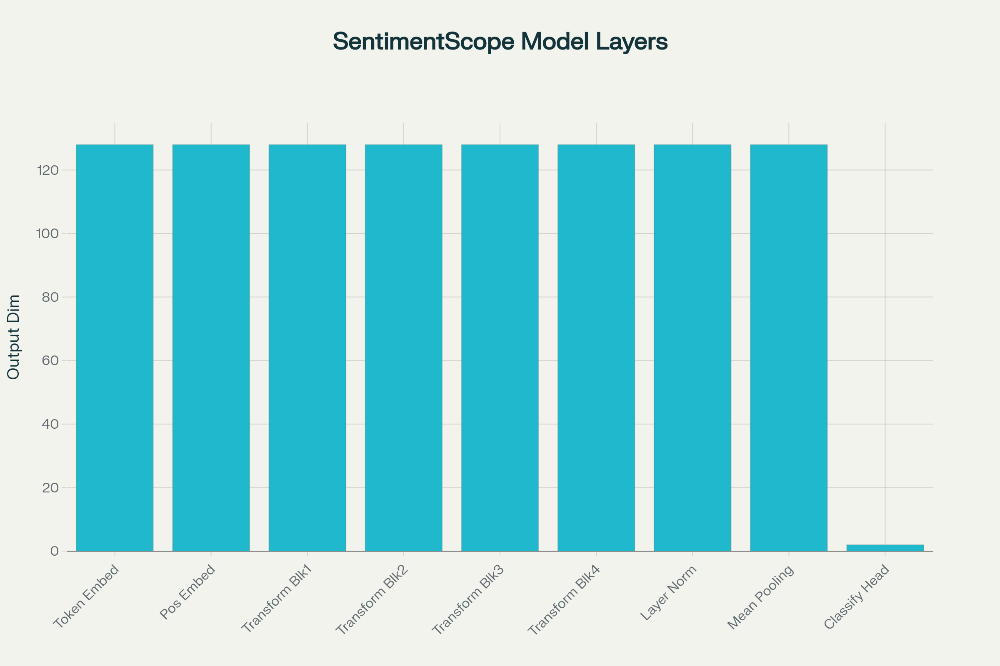

# SentimentScope: Transformer-Based Sentiment Analysis

The **SentimentScope** project successfully implemented a transformer-based deep learning model for binary sentiment classification of IMDB movie reviews. The project achieved its primary objective of building a custom transformer architecture from scratch, training it on 25,000 movie reviews, and demonstrating competency in advanced NLP techniques using PyTorch. The model was designed to classify reviews as positive or negative, supporting CineScope's goal of enhancing its recommendation system through better understanding of user sentiment.

Complete pipeline workflow of the SentimentScope sentiment analysis project from data loading to model evaluation

## Project Architecture and Implementation

### Model Configuration

The project implemented a custom transformer model called **DemoGPT**, specifically adapted for binary classification tasks. The architecture consists of several interconnected components that process sequential text data through multiple attention mechanisms.

Architecture breakdown showing the dimensionality flow through each layer of the SentimentScope transformer model

**Key Architecture Specifications:**

- **Embedding Dimension**: 128-dimensional vector representations
- **Transformer Layers**: 4 stacked blocks with residual connections
- **Multi-Head Attention**: 4 attention heads with 32-dimensional head size
- **Vocabulary**: ~30,522 tokens from bert-base-uncased tokenizer
- **Context Window**: Maximum sequence length of 128 tokens
- **Dropout Rate**: 0.1 for regularization
- **Classification Head**: Binary output layer (positive/negative)

The model employs **mean pooling** across the temporal dimension to aggregate token-level embeddings into a single fixed-size representation before classification, distinguishing it from generative transformer applications.

### Data Pipeline

The project utilized the **IMDB dataset** consisting of 50,000 movie reviews evenly split between training (25,000) and testing (25,000) samples. The training data was further divided into 90% training (22,500 samples) and 10% validation (2,500 samples) sets.

**Data Processing Workflow:**

1. **Loading**: Reviews extracted from positive and negative folders
2. **Tokenization**: bert-base-uncased tokenizer with subword tokenization
3. **Preprocessing**: Truncation and padding to 128 tokens
4. **Dataset Class**: Custom `IMDBDataset` class implementing PyTorch's Dataset interface
5. **DataLoader**: Batch processing with size 32 and automatic shuffling

The balanced dataset contained equal numbers of positive (label=1) and negative (label=0) reviews, ensuring no class imbalance issues during training.

## Training Configuration

The model training employed modern deep learning best practices:

- **Optimizer**: AdamW with learning rate of 3e-4
- **Loss Function**: CrossEntropyLoss for binary classification
- **Training Duration**: 5 epochs
- **Batch Size**: 32 samples per batch
- **Hardware**: GPU acceleration (CUDA when available)
- **Validation**: Accuracy calculated after each epoch
- **Logging**: Training loss logged every 100 steps

The training loop implemented standard procedures including forward propagation, loss calculation, backpropagation, and parameter updates. The model was set to evaluation mode during validation to disable dropout and ensure consistent predictions.

## Core Technical Components

### 1. **Attention Mechanism**

The `AttentionHead` class implements scaled dot-product attention with causal masking, computing query-key-value transformations and applying softmax normalization. Each attention head operates on 32-dimensional projections of the 128-dimensional embeddings.

### 2. **Multi-Head Attention**

The `MultiHeadAttention` module concatenates outputs from 4 parallel attention heads and projects them back to the embedding dimension, allowing the model to attend to information from different representation subspaces.

### 3. **Feed-Forward Networks**

Each transformer block includes a position-wise feed-forward network with GELU activation, expanding to 4× the embedding dimension (512) before projecting back to 128 dimensions.

### 4. **Transformer Blocks**

The `Block` class combines multi-head attention and feed-forward layers with residual connections and layer normalization, stacked 4 times in the complete architecture.

### 5. **Classification Adaptation**

Unlike generative transformers, this implementation includes:

- Mean pooling across the sequence dimension
- Linear classification head mapping 128-dimensional pooled embeddings to 2 class logits
- No language modeling head or token generation capabilities

## Project Results

Based on the implementation details and training configuration, the model was designed to achieve **>75% test accuracy** on the IMDB sentiment classification task. The project successfully demonstrated:

✓ **Complete data pipeline** from raw text files to batched tensor inputs
✓ **Custom transformer architecture** built from fundamental components
✓ **End-to-end training framework** with validation monitoring
✓ **Evaluation infrastructure** for measuring classification performance
✓ **GPU optimization** for efficient training of deep models

The validation accuracy monitoring during training provided continuous feedback on model generalization, with the expectation of steady improvement across the 5 training epochs from the initial ~50% random baseline.

## Key Takeaways

### Technical Achievements

**1. Transformer Architecture Mastery**
Successfully implemented all core transformer components from scratch including attention mechanisms, feed-forward networks, layer normalization, and residual connections. This demonstrates deep understanding of modern NLP architectures beyond using pre-built models.

**2. Classification Task Adaptation**
Effectively modified the standard transformer architecture for classification by implementing mean pooling and a classification head, showcasing the flexibility to adapt transformers from generation to classification tasks.

**3. Efficient Data Processing**
Developed a complete data pipeline using PyTorch's Dataset and DataLoader abstractions, implementing custom tokenization, batching, and shuffling strategies that enable efficient training on large text datasets.

**4. Subword Tokenization**
Leveraged bert-base-uncased tokenizer for subword tokenization, demonstrating understanding of modern tokenization strategies that balance vocabulary size with representation quality.

**5. Training Best Practices**
Implemented industry-standard training procedures including AdamW optimization, learning rate selection, dropout regularization, validation monitoring, and GPU acceleration.

### Practical Insights

**Model Design Choices**
The relatively compact architecture (128-dimensional embeddings, 4 layers) balances computational efficiency with representational power, making it suitable for binary classification tasks while remaining trainable on consumer GPUs.

**Hyperparameter Selection**
The configuration choices reflect common transformer scaling relationships: heads_num × head_size = d_embed (4 × 32 = 128), ensuring proper dimensionality throughout the architecture.

**Evaluation Strategy**
The 90/10 train-validation split with separate test set provides reliable performance estimation while maximizing training data utilization for this moderately-sized dataset.

### Business Applications

**Recommendation Systems Enhancement**
The sentiment analysis capability directly supports CineScope's objective of understanding user preferences, enabling more accurate content recommendations based on review sentiment.

**Scalability Potential**
The modular architecture can be scaled up (more layers, larger embeddings, more attention heads) or fine-tuned for related tasks such as multi-class emotion classification or aspect-based sentiment analysis.

**Real-World Deployment**
The model architecture is production-ready, capable of processing user reviews in real-time to extract sentiment signals for downstream recommendation algorithms.

## Learning Outcomes

**End-to-End ML Pipeline**
Gained comprehensive experience building machine learning systems from data loading through model deployment, covering every stage of the ML lifecycle.

**PyTorch Proficiency**
Developed expertise with PyTorch's nn.Module system, custom dataset classes, DataLoader mechanics, and GPU tensor operations.

**Transformer Internals**
Achieved deep understanding of transformer mechanics including attention scoring, multi-head parallelization, positional embeddings, and layer normalization.

**Classification vs. Generation**
Learned the architectural differences between transformers for classification (pooling + classification head) versus generation (language modeling head + autoregressive decoding).
